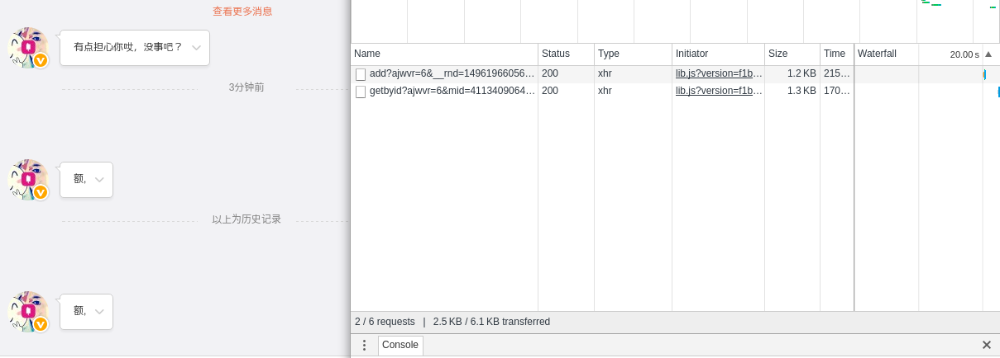
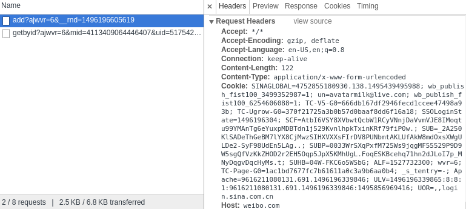

# msxiaoiceapi

## UPDATE

- 支持图片  

## 说明   
需要  python3+ BeautifulSoup flask 

登陆微博 并将headers保存在根目录headers.txt中  
确保已经领养小冰 这里我提供了一个测试账号

## 使用

打开chrome或者firefox  
前往 [微博私信小冰页面](http://weibo.com/message/history?uid=5175429989&name=%E5%B0%8F%E5%86%B0)  
按F12 然后给小冰发送一条消息 如下图  
  
点击第二个 将Request Headers中的所有信息复制到headers.txt中  

    api模式：
    python3 xiaoiceapi.py
    然后在浏览器中输入
    http://127.0.0.1:5000/?que=你是谁
    
    一般模式：
    直接调用xb.chat("你是谁")即可

    return:
    {  
        "status": "succeed",  
        "text": "你都知道你还问[不屑脸]，哈哈党"  
    }

    # 图片
    xb.chat("你的照片")
    {
        'status': 200, 
        'type': 'img', 
        'text': 'http://upload.api.weibo.com/2/mss/msget?source=351354573&fid=4195427450566728'
    }  

## 感谢 
@QingGo
